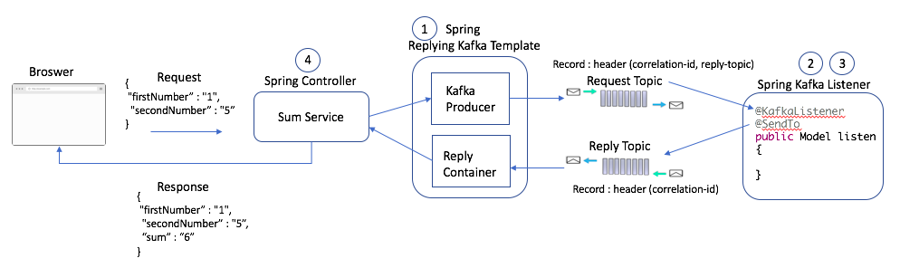
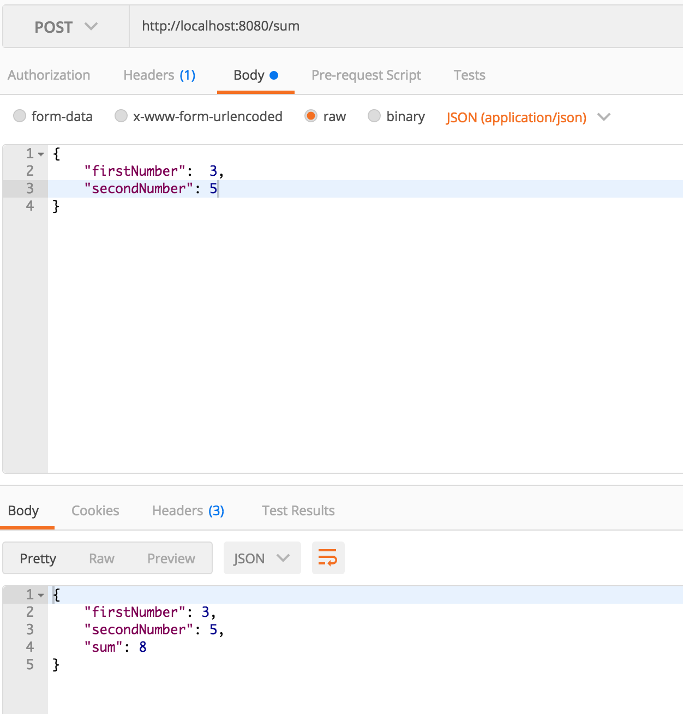
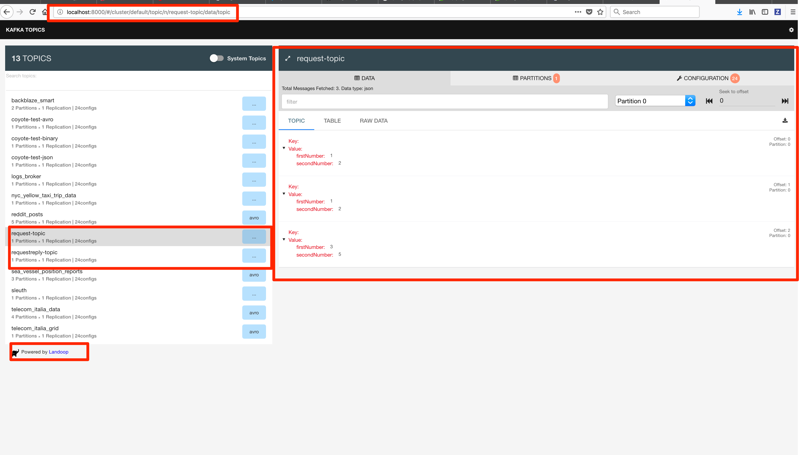
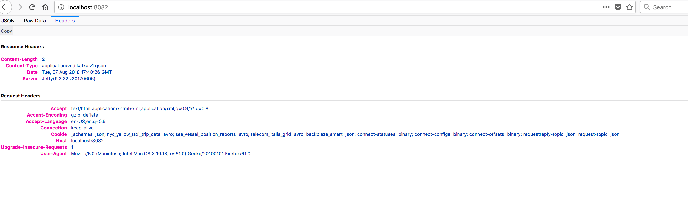
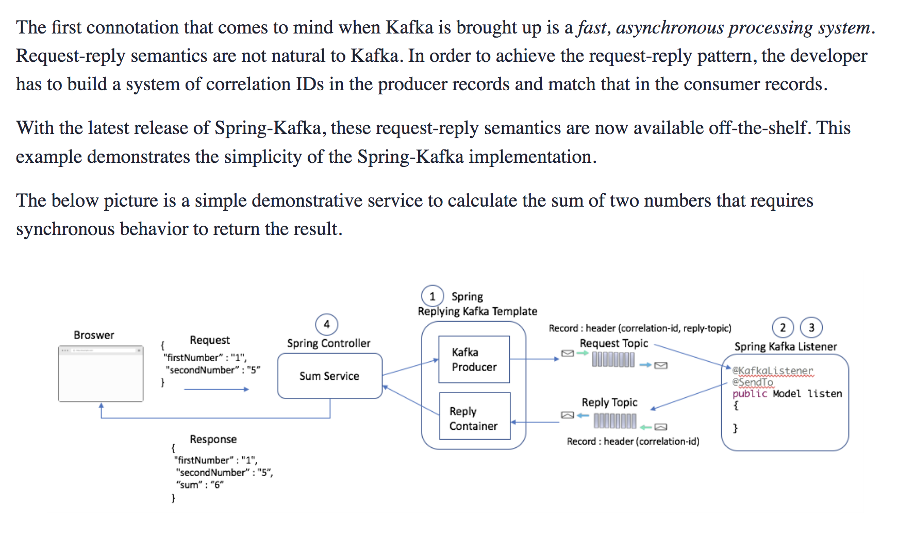
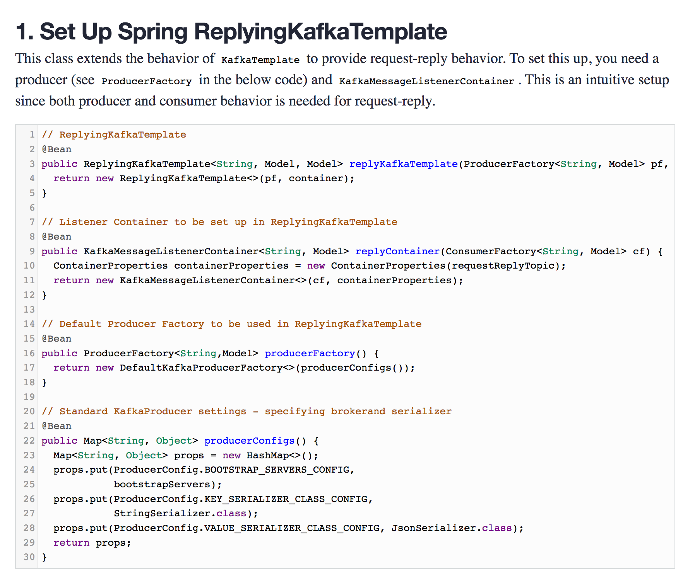
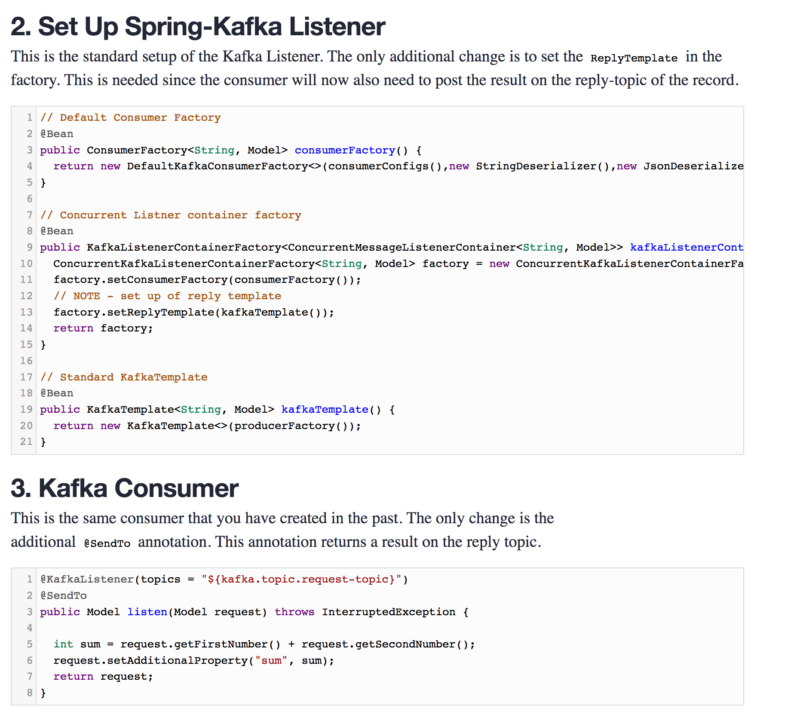
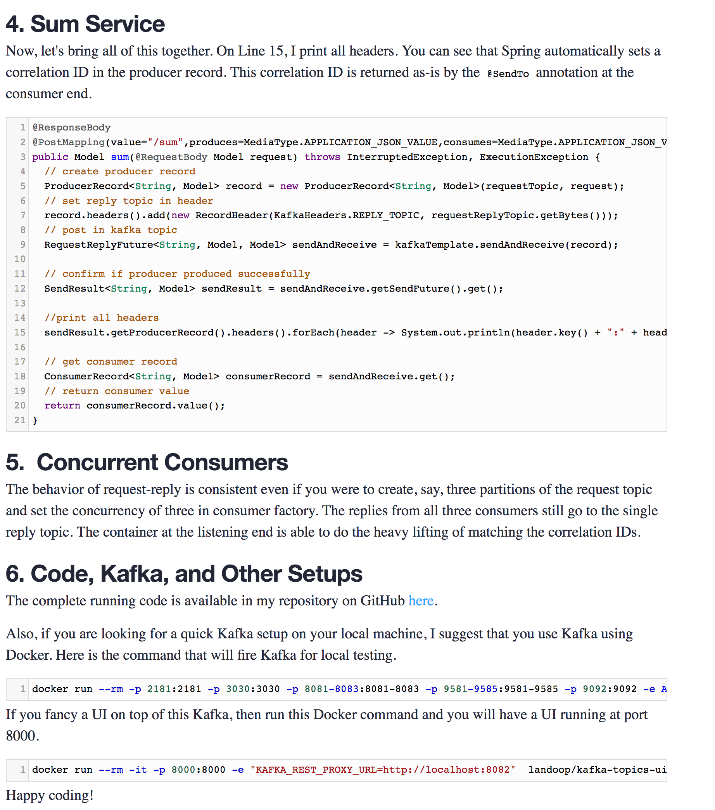

## request_reply_kafka
```
docker run --rm -p 2181:2181 -p 3030:3030 -p 8081-8083:8081-8083 -p 9581-9585:9581-9585 -p 9092:9092 -e ADV_HOST=127.0.0.1 landoop/fast-data-dev:latest
docker run --rm -it -p 8000:8000 -e "KAFKA_REST_PROXY_URL=http://localhost:8082"  landoop/kafka-topics-ui

```
## https://dzone.com/articles/synchronous-kafka-using-spring-request-reply-1
## http://localhost:8082/
## http://localhost:8000




---

# Synchronous Kafka: Using Spring Request-Reply
## With the latest release of Spring-Kafka, request-reply semantics are available off-the-shelf. This example demonstrates the simplicity of the Spring-Kafka implementation.





